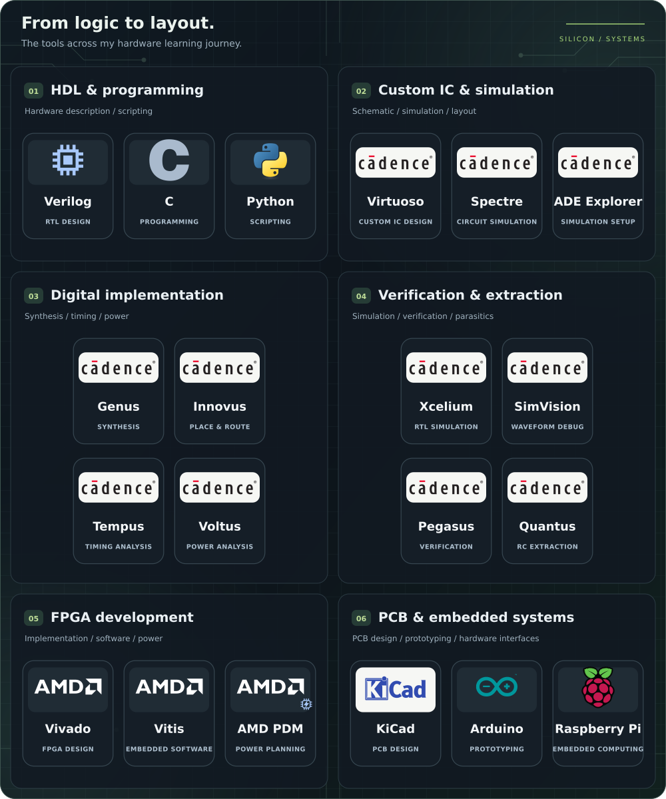

  

<strong>B.Tech Student &nbsp; / &nbsp; Technical Intern at Team Sammpaati</strong>

  
  
  

### Behind the circuits

I'm **Arkaprovo**, a B.Tech student and aspiring VLSI designer. I enjoy understanding how an idea becomes hardware—from logic and transistor behavior to physical layout and verification.

I'm building my foundation in **Verilog, CMOS design, simulation and IC layout**, alongside my technical internship at **Team Sammpaati**. I like asking why a circuit behaves the way it does, then checking the answer through design and simulation.

> **My focus:** understand the fundamentals, build carefully, and let the results guide the next iteration.

### Tools & tech stack

  

### My learning loop

**Understand &nbsp; → &nbsp; Design &nbsp; → &nbsp; Simulate &nbsp; → &nbsp; Verify &nbsp; → &nbsp; Document**

I learn best by connecting theory to practical work, checking assumptions, and writing down what the results actually show.

---

<strong>Let's talk silicon.</strong> 
Happy to connect with people learning and working in VLSI, semiconductors and electronics.  
<a href="https://arkaprovo.vercel.app">Portfolio</a> &nbsp; / &nbsp; <a href="https://www.linkedin.com/in/arkaprovopal">LinkedIn</a> &nbsp; / &nbsp; <a href="mailto:palarko34@gmail.com">palarko34@gmail.com</a>  
Beyond the lab: always curious about new cuisines.

